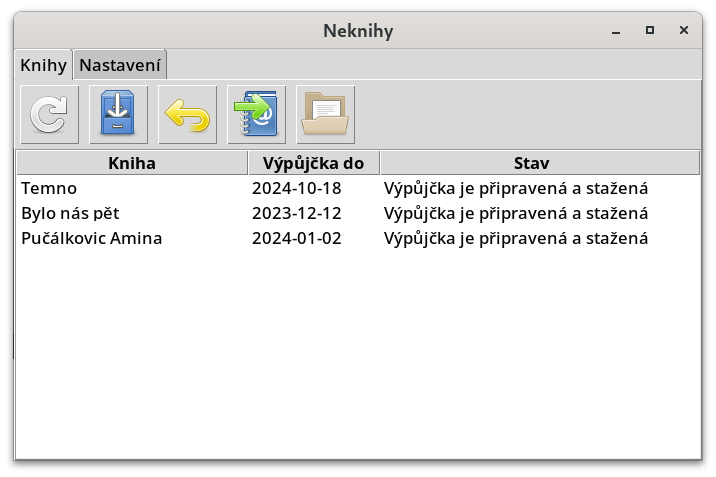

# neknihy
Neknihy is an application for managing rented books.
It works with some libraries in the Czech republic
so the rest is in Czech language only.

## Motivace

Některé knihovny v ČR půjčují i e-knihy, což je skvělé. Bohužel
mobilní aplikce pro čtení nemá moc dobré hodnocení a na velkém
množství čteček nefunguje dobře nebo vůbec.

Proto jsem vytvořil tuto aplikaci, která umožňuje pracovat
s výpujčkami na desktopu. Knihy je možné stáhnout do vybrané
složky odkud se synchronizují s vybranou složkou ve čtečce.

Knihy lze po uplynutí výpůjční doby snadno vrátit přímo tlačítkem
v aplikaci. Při další synchronizaci se čtečkou dojde i k smazání
knih ve čtečce.

Účelem aplikace není nekalé kopírování, ale umožnit
lidem plnohodnotný čtenářský zážitek a komfort.

## Instalace z balíčků

V sekci ["Releases"](https://github.com/thalman/neknihy/releases)
najdete balíčky pro Fedora Linux, Window a MacOS.

### Linux

Ze sekce ["Releases"](https://github.com/thalman/neknihy/releases)
si stáhnete balíček s aplikací na disk a nainstalujte ho

    sudo dnf install ./neknihy*.rpm

### Windows

Ze sekce ["Releases"](https://github.com/thalman/neknihy/releases)
si stáhnete balíček (zip) pro windows na disk. Rozbalte ho a spusťte
aplikaci neknihy.exe

Některé antiviry mohou považovat stažené soubory za podezřelé.
V takovém případě buď nastavte vyjímku v antivirovém programu a nebo
nainstalujte aplikaci ze zdrojových kódů.

### MacOS X

MacOS build je momentálně nedostupný. Instalujte pomocí homebrew (viz níže).

## Screenshot

## Podpora mobi a kindle

Pokud máte nainstalovanou aplikaci [Calibre](https://calibre-ebook.com/),
mohou Neknihy převést vypůjčenou publikaci do formátu `mobi` automaticky.
V záložce `Nastavení` zatrhněte volbu `Převádět na .mobi` a vyplňte cestu
k programu `ebook-convert` (součást Calibre).

### Cesta k programu `ebook-convert` pro MacOS

    /Applications/calibre.app/Contents/MacOS/ebook-convert

## Instalace ze zdrojových kódů

### Linux

Ze sekce ["Releases"](https://github.com/thalman/neknihy/releases)
si stáhněte archiv se zdrojovým kódem. Nainstalujte python3 z distribuce.
Doinstalujte závislosti a spusťte aplikaci. Příklad pro Fedora Linux:

    sudo dnf install python3 python3-requests python3-gobject
    tar -xzf ./neknihy-${RELEASE}.tar.gz
    ./neknihy-${RELEASE}/src/neknihy.py

Příklad instalace s python virtual environment

    sudo dnf install python3
    tar -xzf ./neknihy-${RELEASE}.tar.gz
    cd ./neknihy-${RELEASE}
    python -m venv venv
    source venv/bin/activate
    pip install -r src/REQUIREMENTS.txt
    ./src/neknihy.py

Pokud máte potíže s instalací `PyGObject`, použijte místo něho
`platformdirs` (`pip install platformdirs`)

### Windows

Aplikace pro svůj běh potřebuje Python, stáhněte si a nainstaluje
[Python z oficiálního zdroje](https://www.python.org/downloads/windows/).
Při instalaci vyberte volbu "add python.exe to PATH".

Spusťe si příkazový řádek (cmd) a přesvěčte se, že Python je správně
nainstalován a je možné ho spustit

    c:\...> python --version
    Python 3.11.6

Stáhněte si [zdrojové kódy](https://github.com/thalman/neknihy/releases)
aplikace neknihy (Source code) a rozbalte je na disk. V příkazovém
řádku doinstalujte potřebné závislosti. Volitelně můžete změnit příponu
souboru z .py na .pyw:

    c:\...> cd .....\neknihy\src
    c:\...> python -m pip install -r REQUIREMENTS.txt
    c:\...> copy neknihy.py neknihy.pyw

Aplikace připravena k použití, spustíte ji poklikáním na soubor neknihy.py nebo
neknihy.pyw

### MacOS (s procesory Intel i Apple Silicon (M1 a novější))

Ze sekce ["Releases"](https://github.com/thalman/neknihy/releases)
si stáhněte archiv se zdrojovým kódem. Nainstalujte python3 a knihovnu Tkniter. Doinstalujte závislosti a spusťte apliaci.

#### Příklad instalace přes Homebrew

    brew install python3
    brew install python-tk
    tar -xzf ./neknihy-${RELEASE}.tar.gz
    ./neknihy-${RELEASE}/src/neknihy.py

#### Příklad instalace přes Homebrew a python virtual environment

    brew install python3
    brew install python-tk
    tar -xzf ./neknihy-${RELEASE}.tar.gz
    cd ./neknihy-${RELEASE}
    python -m venv venv
    source venv/bin/activate
    pip install -r src/REQUIREMENTS.txt
    ./src/neknihy.py
